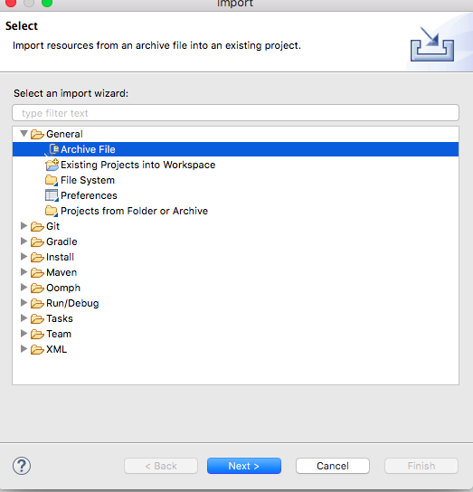
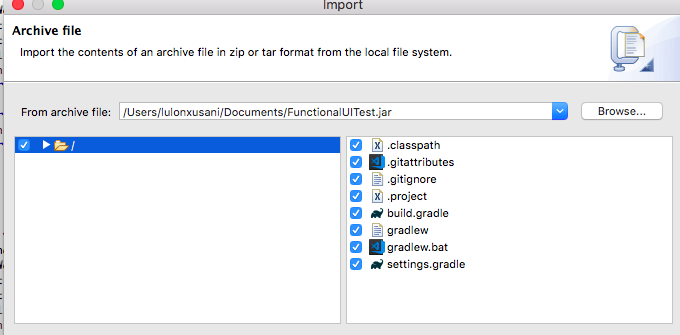
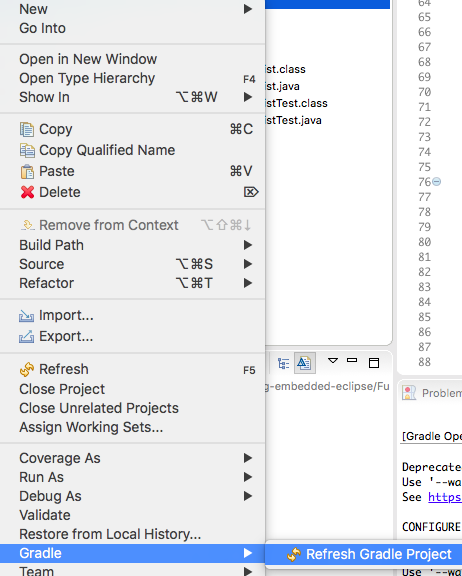
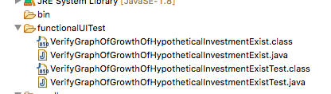
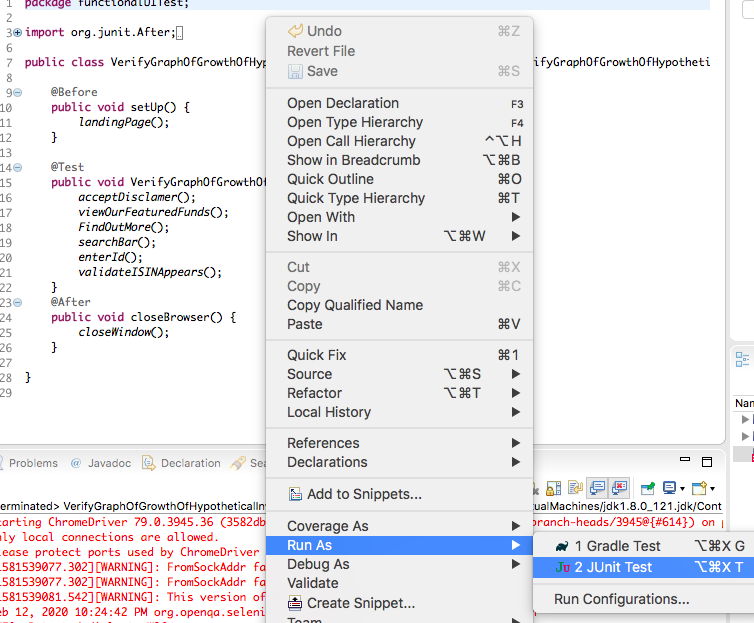

# AutomationTest

## Tools for ui test used:
* Selenium webdriver 
* Gradle build
* Eclipse IDE for Java Developers
* Version: Oxygen Release(4.7.0)
* junit 4.12

## Api test tool used:
* Postman

## How to open and run selenium test:
* Download the  project
* Create a new Java Project and then do File -> Import -> General -> Archive File

 
 
* Browse for the location of the project
* Make sure the new java project is selected on the 'into folder' section
* Ensure all of the files are selected

* Click finish
* Overwrite .classpath and .gitattributes
* Right click on the project -> gradle -> Refresh Gradle Project

* On the project click on functionalUITest

* Run with junit the 'VerifyGraphOfGrowthOfHypotheticalInvestmentExistTest.java' class

* And the methods can be found on the VerifyGraphOfGrowthOfHypotheticalInvestmentExist.java' class

## How to open and run postman test:
* Download the postman project
* Click the Import button in the header bar
* Choose the project

* Make sure dependencies for Junit and Selenium  are added on build.gradle file
* The test is in the "VerifyGraphOfGrowthOfHypotheticalInvestmentExistTest" class which is a child of * "VerifyGraphOfGrowthOfHypotheticalInvestmentExist"
* The steps have been made methods for readability as well as maintanance purposes 
